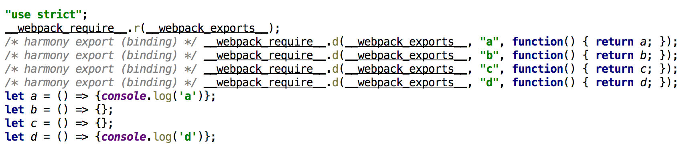
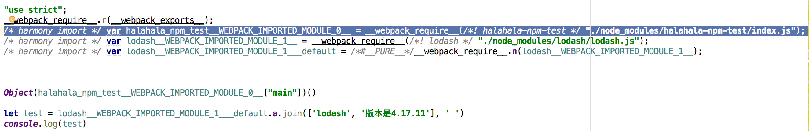
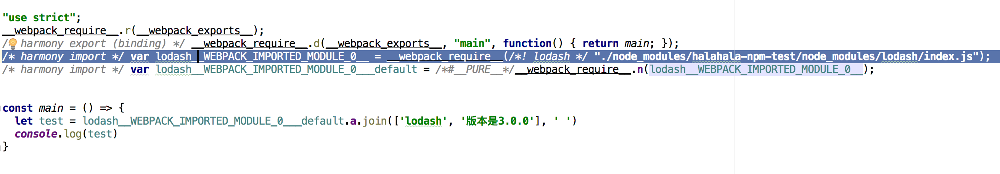
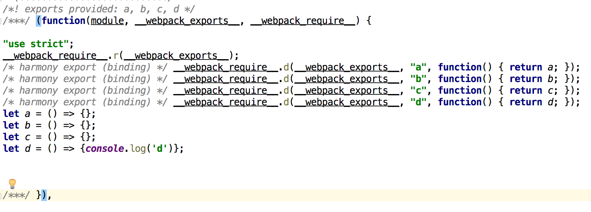

## 概念
webpack是前端最流行的模块化打包工具，但是由于其功能过于复杂，导致大家会对其打包存在一些误区，我们通过实际操作来验证这些疑惑。webpack版本4.33，不使用第三方插件或者loader

### 疑惑1：同一个JS文件，对于没有引入的方法，是否会被打包

结论：会

[具体代码](https://github.com/zhangping1/zhangping1.github.io/tree/master/webpack-demo/src/demo1)

说明：同一个JS文件：util.js，暴露出的方法为a、b、c、d；创建test1和test2，分别引用a、b，在index.js引用test1、test2，执行打包操作

结论：c和d函数都被打包，并且util.js只被打包1次

### 疑惑2：对于同一个库，node_modules中第三方的库引用的版本和业务代码引用的版本不一致，会怎么打包

结论：会打包成2个不同的module

[具体代码](https://github.com/zhangping1/zhangping1.github.io/tree/master/webpack-demo/src/demo2)

说明：同一个库：lodash，第三方的库【halahala-npm-test】引用的版本3.0.0，业务代码的版本4.17.11；

结论：根据npm的引用规则进行打包，打成2个module

### 疑惑3：引入的方法没有被使用，会不会被打包

结论：会

[具体代码](https://github.com/zhangping1/zhangping1.github.io/tree/master/webpack-demo/src/demo3)

说明：JS文件：util.js；在index.js引用util，但不使用，执行打包操作

结论：会被打包

