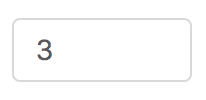
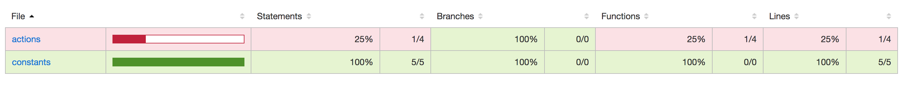

## 概念
Jest是 Facebook 的一套开源的 JavaScript 测试框架， 它自动集成了断言、JSDom、覆盖率报告等开发者所需要的所有测试工具。在组件开发过程中，需要编写单测来保证每次组件升级不会导致之前的功能出错

## 开始
Jest几乎可以说是零配置，只需简单几步，即可引入。
    
    // 初始化项目
    mkdir jest-demo
    cd jest-demo
    npm init 
    
    // 安装jest
    npm i -D jest
    // 修改package.json
    {
      "scripts": {
        "test": "jest"
      }
    }
    
    // 编写测试demo
    mkdir src ## 存放源代码
    mkdir __test__ ## 存放单测用例
    
    // 编写求和函数
    cd src 
    vi sum.js
    // 粘贴如下代码
    function sum(a, b) {
      return a + b;
    }
    module.exports = sum;
    
    // 编写测试用例，jest会扫描.spec.js或.test.js文件命名的测试文件并执行
    cd __test__
    vi sum.test.js
    // 粘贴如下代码
    const sum = require('../src/sum');
    
    describe('sum', () => {
      test('使用sum函数，测试整数相加', () => {
        // 初始化
        beforeAll(() => {
          // 预处理操作
        })
        // 调用代码
        const result = sum(1, 2)
        // 断言
        expect(result).toBe(3);
      });
    })

    // 运行
    npm test
    
## 测试用例编写    
jest虽然开始容易，但要想要编写测试用例，并在实际的项目中使用jest，还需要学习jest提供的api和熟悉单测编写的过程。

1、单测编写的过程

  (1) 模块拆分。
  
  例如：一个inputNumber的输入框
  
  
  应该分为以下部分：
  
  a、传入的参数处理：输入框是否正常渲染；传入的props的placeholder等是否能正确渲染
  
  b、自身逻辑处理：模拟键盘事件，是否只能输入数字；如果提供了校验等方法，需要判断校验时，错误提示是否正常显示
  
  c、调用外界方法：如果对外提供了onFocus、onChange、onBlur等事件，需要判断传入的props的方法是否被调用，并且传出的参数正确
   
  (2) 编写测试用例

  a、为测试用例命名。
  
  合适的测试名称有利于我们了解这个用例。
  
  例如：JS中的加法处理0.1+0.2的时候会出现0.30000000000000004的结果，所以我们的测试用例其实应该分为整数和小数两种，一个好的名字应该是尽可能完整的描述这个测试过程。如果我们名字为【测试sum函数】，那么显然，我们会忽略某些情况
  
  b、初始化。如果需要对一些数据进行预处理，如获取props所传参数等
  
  c、调用代码。调用我们编写的代码，传入参数   
  
  d、断言。概念：判断编写的代码是否达到我们的预期行为。如：expect(sum(1, 2)).toBe(3) 我们的期望是sum函数，输入1和2，输出3；如果修改为expect(sum(1, 2)).toBe(4) 运行npm test，则会提示错误Expected: 4，Received: 3
     
  (3) 运行
  
  通过生成覆盖率报表，来判断我们的测试是否完整；查看测试结果，发现代码中的问题
        
    
  报告说明
    
  a、Statements（声明语句的覆盖率）
  
  除了 import 和 require 以外，所有赋值给变量的语句都是 “声明”  
  
  b、branches
  
  方法中的 if/else 等判断分支 
  
  c、function
  
  方法的个数
  
  d、lines 
  
  代码的行数 
    
2、常用api的学习

jest的api还不能满足我们所有的测试过程，所以我们需要enzyme。enzyme能提供 jQuery 风格的方式进行DOM 处理，如：wrapper.find('').text()

    // describe
    describe()表示一组用例的集合
    
    // test/it
    test()函数表示一个测试用例，it和test是同样的意思  
    
    // except
    except()表示断言或者验证，有许多常用的验证方法，如：toEqual、toBeCalled、toBe    
    
    // enzyme
    shallow() 渲染组件，find、simulate、exists等操作DO
