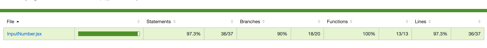

## 概述
通过create-react-app快速创建react项目, 使用jest-enzyme代替enzyme，减少编译的配置。编写inputNumber组件，并为其编写单测，通过该过程熟悉jest。

## inputNumber组件规划（基本功能，不应用于复杂场景）

源码见react-jest-demo

### 功能：

1、自身功能：

1.1、只允许输入数字

1.2、允许输入正数或者负数

1.3、允许输入小数，并可设置小数点位数

1.4、允许外界传入placeholder、value，并且可以覆盖默认的已有属性

1.5、外界可以传入onChange、onFocus、onBlur方法，并且参数为e

2、提供给外界的功能：

2.1、外界可以调用focus、blur方法控制焦点

### 调用demo：

    <InputNumber 
        isSupportNegative = {false}
        precision = {1}
        onChange = {this.handleChange.bind(this)}
        onFocus = {this.handleFocus.bind(this)}
        onBlur = {this.handleBlur.bind(this)}
        {...inputProps}
    />

### API:

isSupportNegative（boolean）: 是否支持负数，默认值false,

precision（number）: 数值精度，默认值0，即不为小数

onChange（function）: 数值改变的回调,

onFocus（function）: 聚焦的回调,

onBlur（function）: 失焦的回调,

inputProps（object）: input的原始属性

focus: 提供给外界调用的方法

blur: 提供给外界调用的方法

## 代码编写

### 组件

### 单测
    
    // 组件是否正常渲染（接受外界的传参后）
    1、input是否存在dom
    2、传入placeholder，input是否显示
    
    // 组件自身逻辑
    1、精度的判读
    2、正负的判断
    3、只能输入数字
    4、onChange方法在输入错误的情况下不被调用
    
    // 调用外界方法
    1、onFocus和focus方法被正常调用
    2、onBlur和blur方法被正常调用
    3、onChange方法被正常调用

单测的编写的确很需要时间，也会有部分功能不能覆盖，但是如果组件被很多项目所使用，最好还是编写单测，否则修改组件代码会变成很恐怖的事情。

### 运行测试
    

覆盖率已经达到90%，并且测试通过，表示编写的组件基本达到要求，可以被使用     

